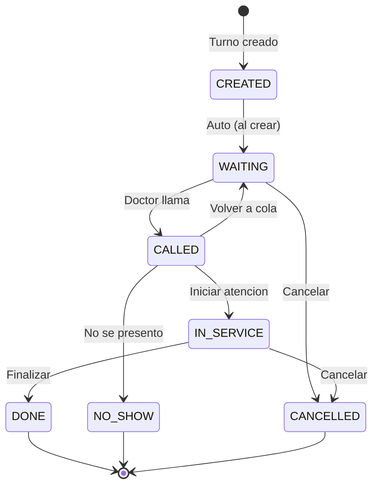
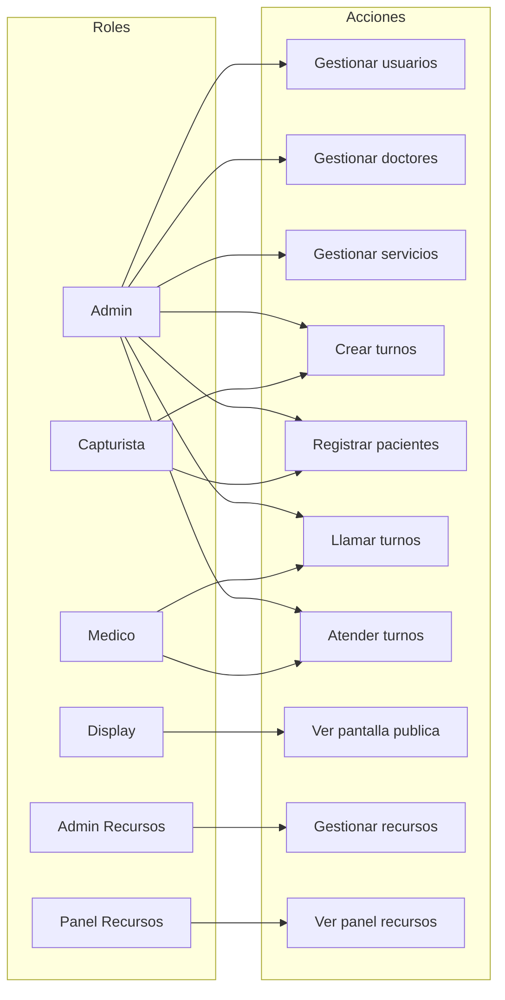
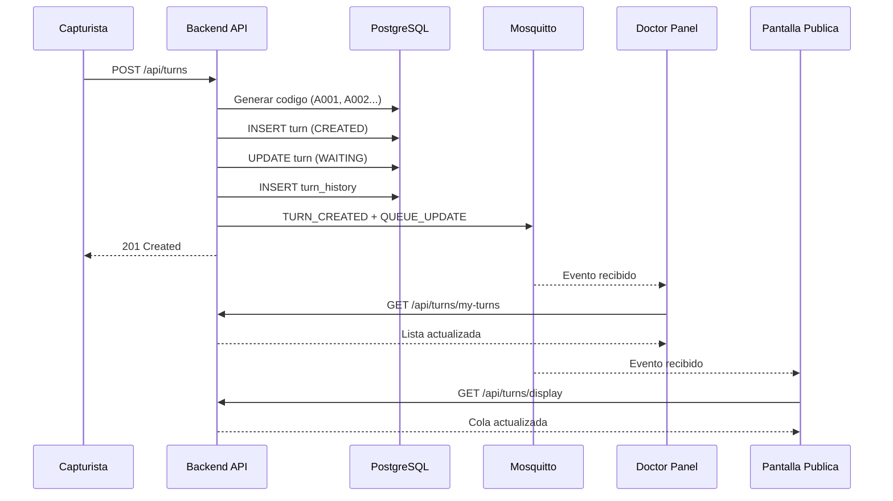
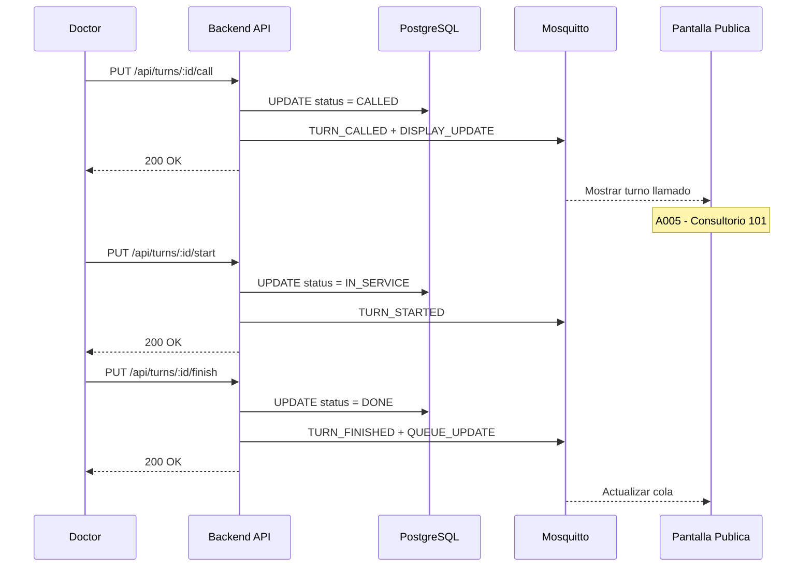
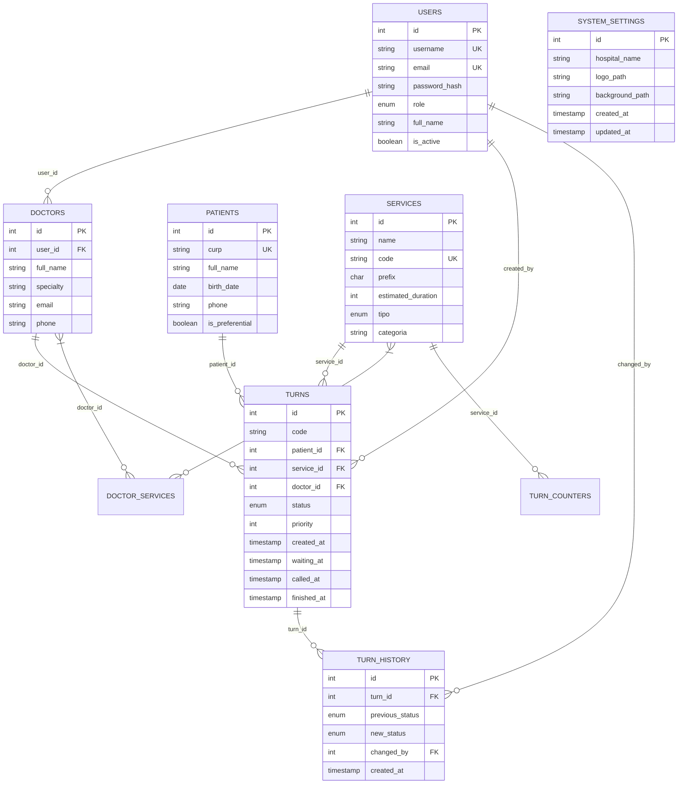
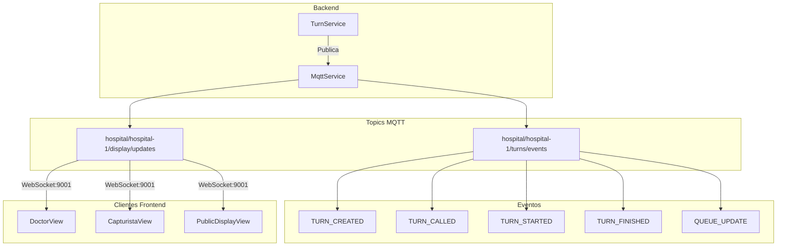
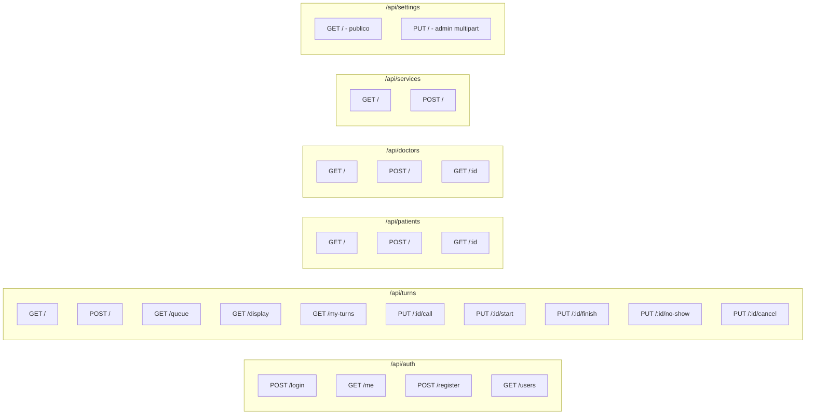
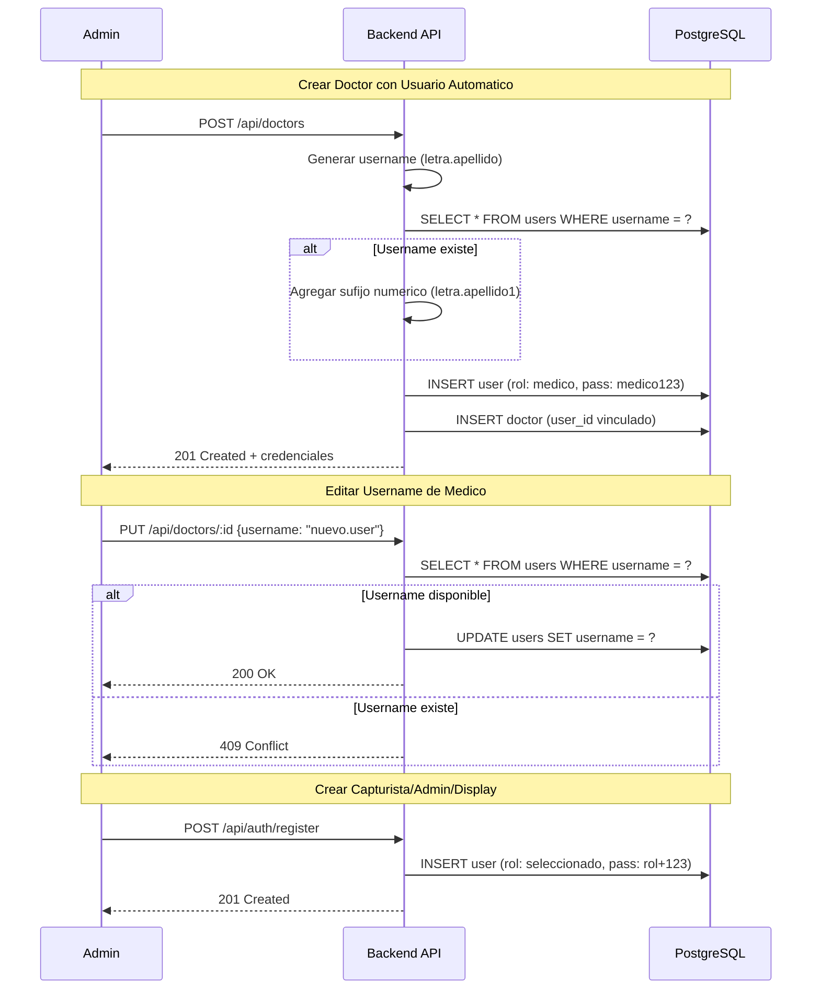
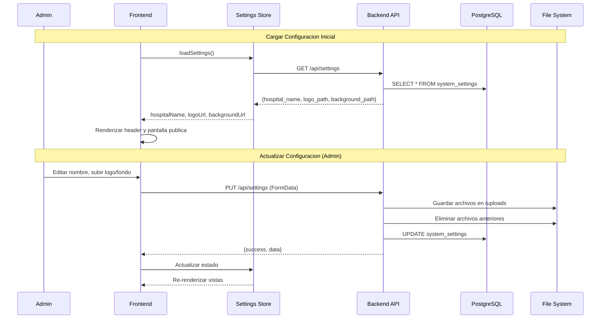
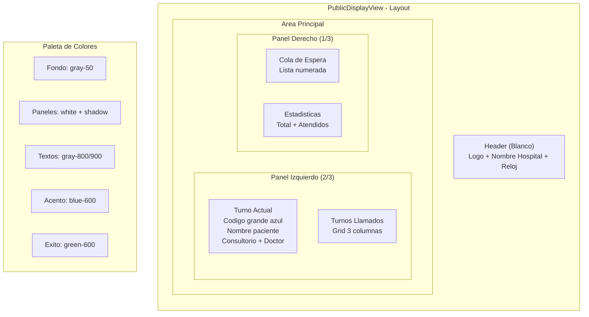

# Diagrama del Sistema de Turnos Hospitalarios

## 1. Arquitectura General

```mermaid
flowchart TB
    subgraph Frontend["Frontend (Vue.js 3)"]
        Login[LoginView]
        Cap[CapturistaView]
        Doc[DoctorView]
        Admin[AdminView + Config Tab]
        Display[PublicDisplayView<br/>Diseno Minimalista]
        SettingsStore[(Settings Store)]
    end

    subgraph Backend["Backend (Node.js/Express)"]
        API[REST API]
        Auth[Auth Middleware]
        Controllers[Controllers]
        SettingsCtrl[SettingsController]
        Services[Services]
        Models[Models]
        Uploads[/uploads Static Files]
    end

    subgraph Infra["Infraestructura"]
        PG[(PostgreSQL)]
        MQTT[Mosquitto MQTT]
        FS[File System<br/>uploads/]
    end

    Frontend -->|HTTP/REST| API
    API --> Auth
    Auth --> Controllers
    Auth --> SettingsCtrl
    Controllers --> Services
    SettingsCtrl --> Models
    SettingsCtrl --> FS
    Services --> Models
    Models --> PG
    Services -->|Publish| MQTT
    MQTT -->|WebSocket| Frontend
    Frontend -->|GET /uploads/*| Uploads
    SettingsStore -->|loadSettings| API
```

## 2. Flujo de Estados del Turno



## 3. Roles y Permisos



## 4. Flujo de Creacion de Turno



## 5. Flujo de Atencion de Turno



## 6. Modelo de Base de Datos



## 7. Comunicacion MQTT



## 8. Endpoints API



## 9. Flujo de Creacion Automatica de Usuarios



### Logica de Generacion de Credenciales

| Rol | Username | Email | Password |
|-----|----------|-------|----------|
| Medico | letra.apellido (j.perez) | email del formulario | medico123 |
| Admin | nombre normalizado | username@hospital.com | admin123# |
| Capturista | nombre normalizado | username@hospital.com | captura123# |
| Display | nombre normalizado | username@hospital.com | display123 |
| Admin Recursos | nombre normalizado | username@hospital.com | recurso123# |
| Panel Recursos | nombre normalizado | username@hospital.com | panrecurso123 |

**Formato de Username para Medicos:**
- Primera letra del nombre + punto + primer apellido
- Ejemplo: "Juan Perez Garcia" → `j.perez`
- Ejemplo: "Maria Lopez Hernandez" → `m.lopez`
- Si existe, agrega sufijo: `j.perez1`, `j.perez2`, etc.

**Normalizacion de nombre (otros roles):**
- Convertir a minusculas
- Eliminar acentos
- Reemplazar espacios con puntos
- Ejemplo: "Dr. Maria Garcia" → "dr.maria.garcia"

---

## 10. Flujo de Configuracion del Sistema



## 11. Diseno Minimalista - Pantalla Publica



### Componentes Visuales

| Componente | Estilo |
|------------|--------|
| Fondo | `bg-gray-50` (gris muy claro) |
| Header | `bg-white shadow-sm border-b` |
| Panel turno actual | `bg-white rounded-2xl shadow-lg` |
| Codigo turno | `text-8xl font-bold text-blue-600` |
| Paneles secundarios | `bg-white rounded-xl shadow-md` |
| Items de lista | `bg-gray-50 border border-gray-200` |
| Titulos | `text-gray-600 uppercase tracking-wider` |
| Textos | `text-gray-800` / `text-gray-900` |

---

**Ultima actualizacion:** 2026-01-18 (v8 - Campos tipo y categoria en servicios)
