# Diagrama del Sistema de Turnos Hospitalarios

## 1. Arquitectura General

```mermaid
flowchart TB
    subgraph Frontend["Frontend (Vue.js 3)"]
        Login[LoginView]
        Cap[CapturistaView]
        Recep[RecepcionView<br/>Pantalla Minimalista]
        Doc[DoctorView]
        Admin[AdminView + Config Tab]
        Display[PublicDisplayView<br/>Diseno Minimalista]
        DisplayHB[DisplayHabitacionesView<br/>Grid de Habitaciones]
        SettingsStore[(Settings Store)]
    end

    subgraph Backend["Backend (Node.js/Express)"]
        API[REST API]
        Auth[Auth Middleware]
        Controllers[Controllers]
        SettingsCtrl[SettingsController]
        Services[Services]
        Models[Models]
        Uploads[/uploads Static Files]
    end

    subgraph Infra["Infraestructura"]
        PG[(PostgreSQL)]
        MQTT[Mosquitto MQTT]
        FS[File System<br/>uploads/]
    end

    Frontend -->|HTTP/REST| API
    API --> Auth
    Auth --> Controllers
    Auth --> SettingsCtrl
    Controllers --> Services
    SettingsCtrl --> Models
    SettingsCtrl --> FS
    Services --> Models
    Models --> PG
    Services -->|Publish| MQTT
    MQTT -->|WebSocket| Frontend
    Frontend -->|GET /uploads/*| Uploads
    SettingsStore -->|loadSettings| API
```

## 2. Flujo de Estados del Turno

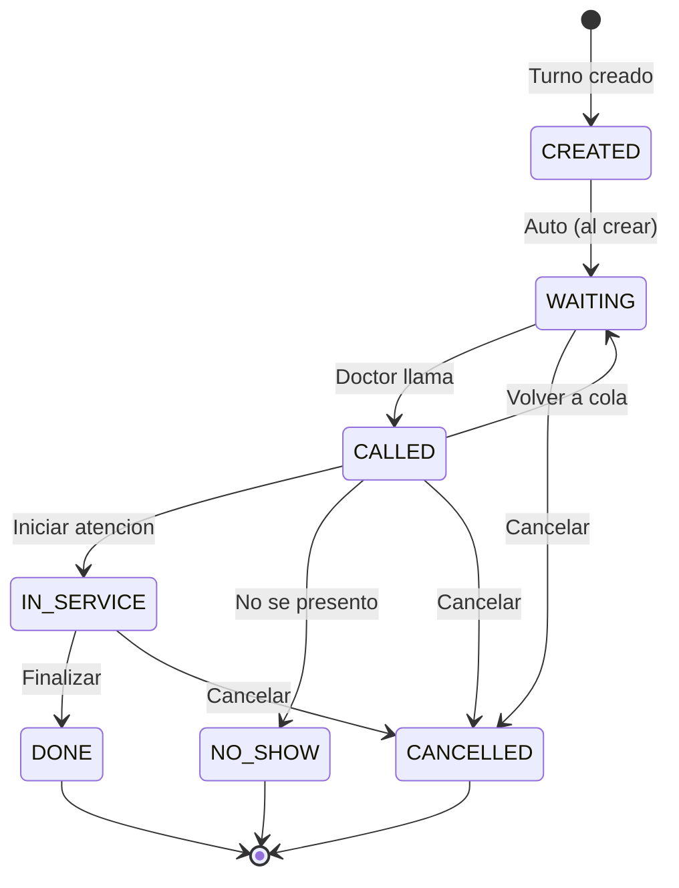

## 3. Roles y Permisos

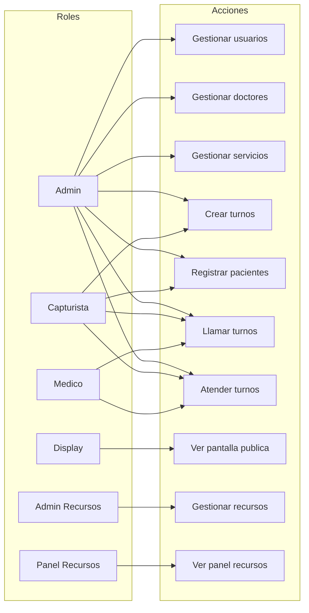

## 4. Flujo de Creacion de Turno


## 5. Flujo de Atencion de Turno


## 6. Modelo de Base de Datos

```mermaid
erDiagram
    USERS ||--o{ DOCTORS : "user_id"
    USERS ||--o{ TURNS : "created_by"
    USERS ||--o{ TURN_HISTORY : "changed_by"

    PATIENTS ||--o{ TURNS : "patient_id"
    DOCTORS ||--o{ TURNS : "doctor_id"
    SERVICES ||--o{ TURNS : "service_id"

    TURNS ||--o{ TURN_HISTORY : "turn_id"

    DOCTORS }|--o{ DOCTOR_SERVICES : "doctor_id"
    SERVICES }|--o{ DOCTOR_SERVICES : "service_id"

    SERVICES ||--o{ TURN_COUNTERS : "service_id"

    USERS {
        int id PK
        string username UK
        string email UK
        string password_hash
        enum role
        string full_name
        boolean is_active
    }

    PATIENTS {
        int id PK
        string curp UK
        string full_name
        date birth_date
        string phone
        boolean is_preferential
    }

    DOCTORS {
        int id PK
        int user_id FK
        string full_name
        string specialty
        string email
        string phone
    }

    SERVICES {
        int id PK
        string name
        string code UK
        char prefix
        int estimated_duration
        enum tipo
        string categoria
    }

    TURNS {
        int id PK
        string code
        int patient_id FK
        int service_id FK
        int doctor_id FK
        int consultorio_id FK
        enum status
        int priority
        timestamp created_at
        timestamp waiting_at
        timestamp called_at
        timestamp finished_at
    }

    RECURSOS ||--o{ TURNS : "consultorio_id"

    TURN_HISTORY {
        int id PK
        int turn_id FK
        enum previous_status
        enum new_status
        int changed_by FK
        timestamp created_at
    }

    SYSTEM_SETTINGS {
        int id PK
        string hospital_name
        string logo_path
        string background_path
        timestamp created_at
        timestamp updated_at
    }

    HOSPITALIZACIONES {
        int id PK
        string paciente_nombre
        string paciente_apellidos
        string telefono
        string habitacion
        int doctor_id FK
        timestamp fecha_ingreso
        timestamp fecha_egreso
        enum estatus
        text notas
        boolean is_active
        timestamp created_at
        timestamp updated_at
    }

    RECURSOS {
        int id PK
        string nombre
        string codigo UK
        enum tipo
        string ubicacion
        int capacidad
        text descripcion
        boolean is_active
        timestamp created_at
        timestamp updated_at
    }

    USO_RECURSOS {
        int id PK
        int recurso_id FK UK
        string paciente_nombre
        string paciente_apellidos
        string telefono
        int doctor_id FK
        timestamp fecha_inicio
        enum estatus
        text notas
        timestamp created_at
        timestamp updated_at
    }

    HISTORIAL_RECURSOS {
        int id PK
        int recurso_id FK
        string recurso_nombre
        string recurso_tipo
        string paciente_nombre
        string paciente_apellidos
        string telefono
        int doctor_id FK
        string doctor_nombre
        string especialidad
        timestamp fecha_inicio
        timestamp fecha_fin
        int duracion_minutos
        string estatus_final
        text notas
        timestamp created_at
    }

    DOCTORS ||--o{ HOSPITALIZACIONES : "doctor_id"
    RECURSOS ||--o{ USO_RECURSOS : "recurso_id"
    RECURSOS ||--o{ HISTORIAL_RECURSOS : "recurso_id"
    DOCTORS ||--o{ USO_RECURSOS : "doctor_id"
    DOCTORS ||--o{ HISTORIAL_RECURSOS : "doctor_id"
```

## 7. Comunicacion MQTT

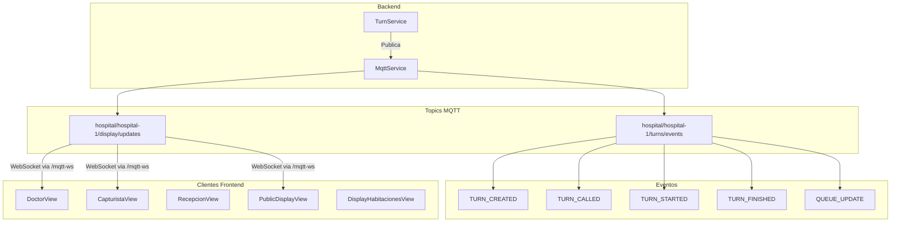

## 7.1 Arquitectura de Red

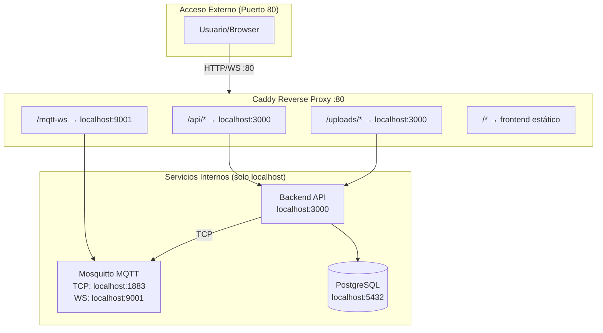

### Beneficios de la Arquitectura
| Aspecto | Descripcion |
|---------|-------------|
| **Seguridad** | Solo puerto 80 expuesto, servicios internos en localhost |
| **IP Dinámica** | Frontend usa rutas relativas, funciona sin configurar IP |
| **Simplicidad** | Todo el tráfico pasa por Caddy como punto único de entrada |
| **HTTPS Ready** | Caddy puede agregar HTTPS sin cambios en servicios internos |

## 8. Endpoints API

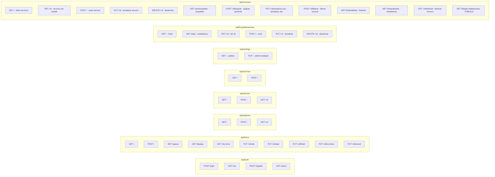

## 9. Flujo de Creacion Automatica de Usuarios


### Logica de Generacion de Credenciales

| Rol | Username | Email | Password |
|-----|----------|-------|----------|
| Medico | letra.apellido (j.perez) | email del formulario | medico123 |
| Admin | nombre normalizado | username@hospital.com | admin123# |
| Capturista | nombre normalizado | username@hospital.com | captura123# |
| Display | nombre normalizado | username@hospital.com | display123 |
| Admin Recursos | nombre normalizado | username@hospital.com | recurso123# |
| Panel Recursos | nombre normalizado | username@hospital.com | panrecurso123 |

**Formato de Username para Medicos:**
- Primera letra del nombre + punto + primer apellido
- Ejemplo: "Juan Perez Garcia" → `j.perez`
- Ejemplo: "Maria Lopez Hernandez" → `m.lopez`
- Si existe, agrega sufijo: `j.perez1`, `j.perez2`, etc.

**Normalizacion de nombre (otros roles):**
- Convertir a minusculas
- Eliminar acentos
- Reemplazar espacios con puntos
- Ejemplo: "Dr. Maria Garcia" → "dr.maria.garcia"

---

## 10. Flujo de Configuracion del Sistema


## 11. Diseno Minimalista - Pantalla Publica


### Componentes Visuales

| Componente | Estilo |
|------------|--------|
| Fondo | `bg-gray-50` (gris muy claro) |
| Header | `bg-white shadow-sm border-b` |
| Panel turno actual | `bg-white rounded-2xl shadow-lg` |
| Codigo turno | `text-8xl font-bold text-blue-600` |
| Paneles secundarios | `bg-white rounded-xl shadow-md` |
| Items de lista | `bg-gray-50 border border-gray-200` |
| Titulos | `text-gray-600 uppercase tracking-wider` |
| Textos | `text-gray-800` / `text-gray-900` |

---

## 12. Flujo de Gestion de Recursos Unificado

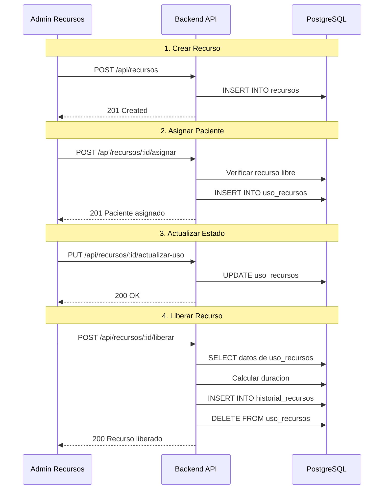

### Tipos de Recursos
| Tipo | Descripcion | Estatus Comunes |
|------|-------------|-----------------|
| CONSULTORIO | Consultorios medicos | OCUPADO |
| HABITACION | Habitaciones de internado | HOSPITALIZACION, QUIROFANO, RECUPERACION, TERAPIA, URGENCIAS |

### Estados de Uso
| Estado | Descripcion |
|--------|-------------|
| OCUPADO | Ocupacion generica (consultorios) |
| HOSPITALIZACION | Paciente hospitalizado |
| QUIROFANO | En quirofano |
| RECUPERACION | En recuperacion |
| TERAPIA | En terapia |
| URGENCIAS | Atencion de urgencias |
| MANTENIMIENTO | Recurso en mantenimiento |

---

---

## 13. Pantalla Publica de Habitaciones (/display-hb)

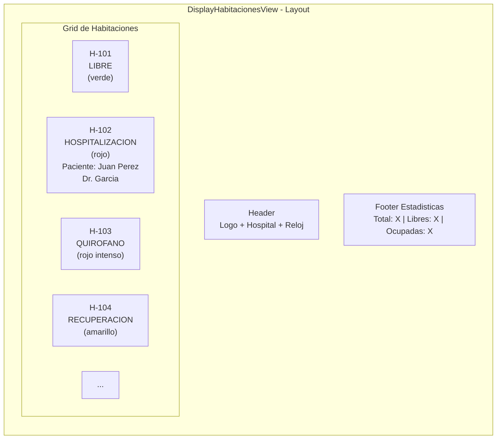

### Colores por Estado
| Estado | Color | Clase CSS |
|--------|-------|-----------|
| LIBRE | Verde | `bg-green-600` |
| HOSPITALIZACION | Rojo | `bg-red-600` |
| QUIROFANO | Rojo intenso | `bg-red-700 animate-pulse` |
| RECUPERACION | Amarillo | `bg-yellow-600` |
| TERAPIA | Purpura | `bg-purple-600` |
| URGENCIAS | Naranja | `bg-orange-600 animate-pulse` |
| MANTENIMIENTO | Gris | `bg-gray-600` |

### Flujo de Datos

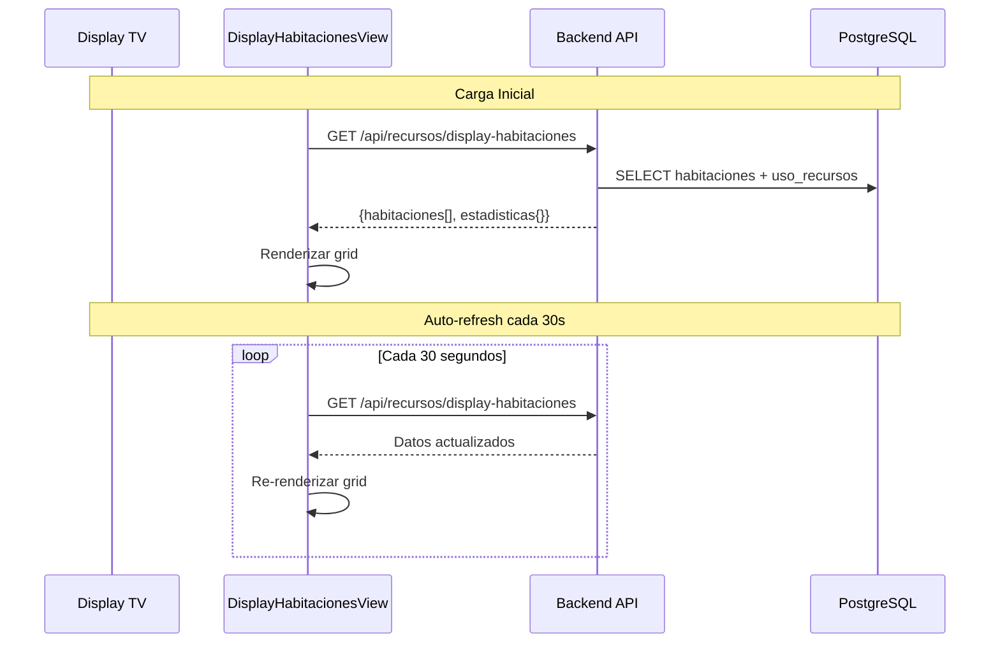

### Caracteristicas
- **Sin autenticacion**: Endpoint publico para pantallas compartidas
- **Auto-refresh**: Actualiza automaticamente cada 30 segundos
- **Responsive**: Grid adaptable para diferentes tamanos de pantalla
- **Optimizado para TV**: Fondo oscuro, texto grande, alto contraste

---

## 14. Pantalla de Recepcion (/recepcion)

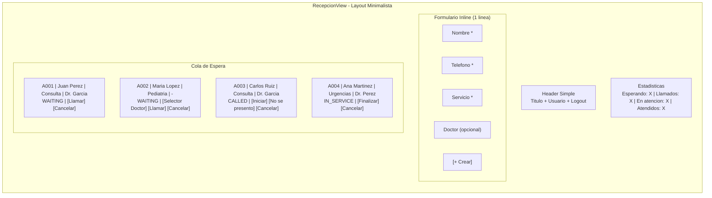

### Acciones por Estado
| Estado | Botones Disponibles |
|--------|---------------------|
| WAITING | [Llamar] [Cancelar] |
| CALLED | [Iniciar] [No se presento] [Cancelar] |
| IN_SERVICE | [Finalizar] [Cancelar] |

### Caracteristicas
- **Doctor opcional para llamar**: Se puede llamar un turno sin doctor asignado
- **Selector de doctor inline**: Si el turno no tiene doctor, aparece un selector al lado del boton Llamar
- **Tiempo real via MQTT**: Actualizaciones automaticas
- **Roles permitidos**: admin, capturista

### Flujo de Uso

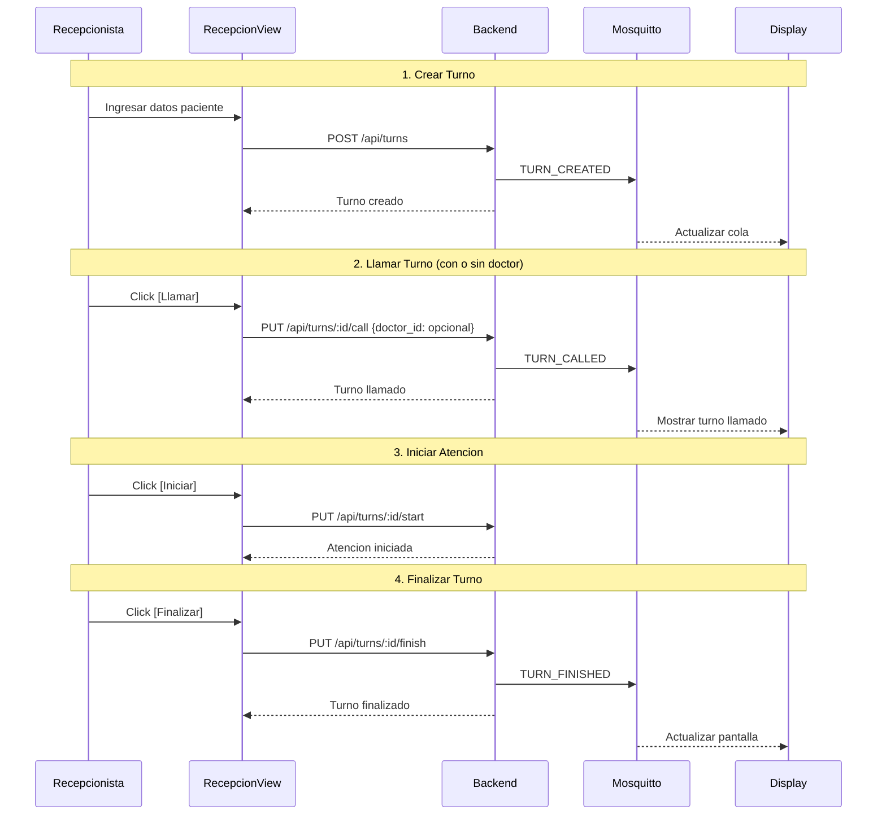

---

## 15. Flujo de Generacion de Codigo de Turno (con proteccion de timezone)

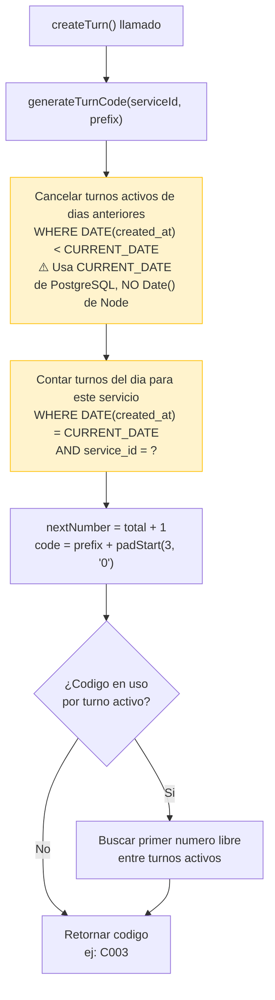

### Problema de Timezone Resuelto

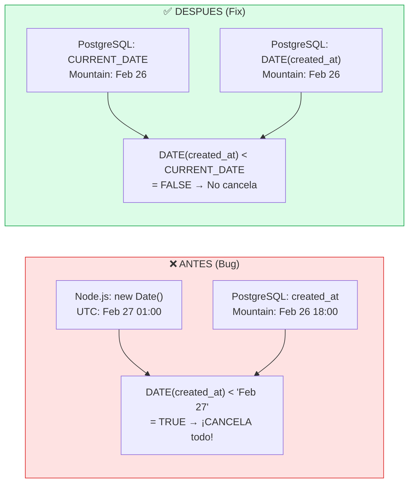

## 16. Flujo de Borrado y Re-creacion de Medicos

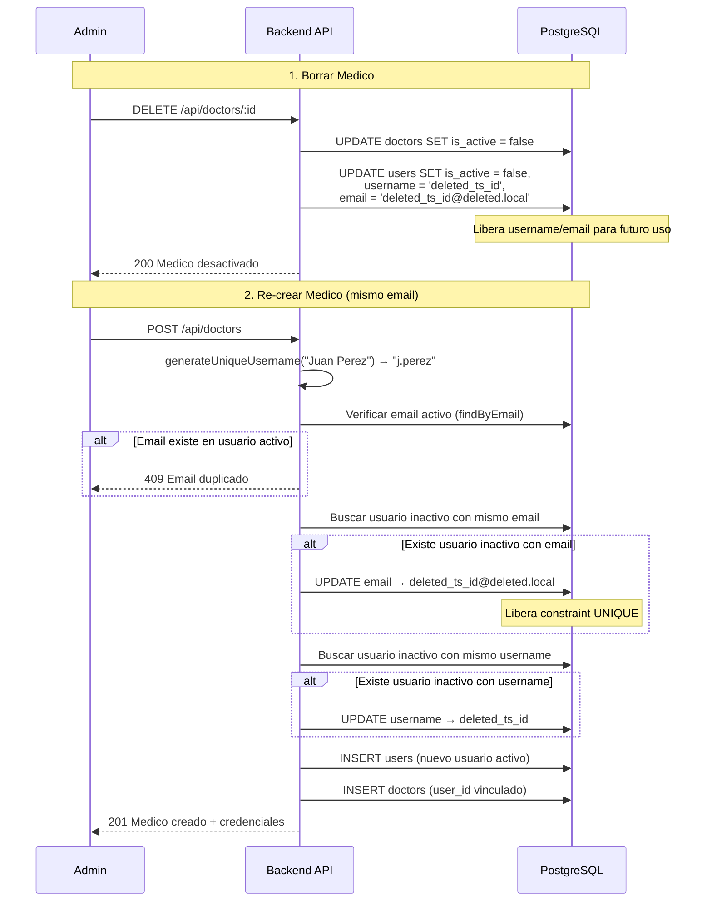

## 17. Sincronizacion Doctor ↔ Usuario

```mermaid
flowchart TD
    subgraph Update["Al actualizar doctor (PUT /api/doctors/:id)"]
        U1["Recibir datos: full_name, specialty, etc."]
        U2{"¿Cambio full_name?"}
        U2 -->|Si| U3["User.update(user_id, {full_name})"]
        U2 -->|No| U4["Continuar"]
        U3 --> U4
        U4 --> U5{"¿Cambio username?"}
        U5 -->|Si| U6["Verificar disponibilidad"]
        U6 --> U7["User.update(user_id, {username})"]
        U5 -->|No| U8["Doctor.update(id, data)"]
        U7 --> U8
    end

    subgraph Scripts["Scripts de mantenimiento"]
        S1["sync-doctor-names.js<br/>Corrige: doctors.full_name ≠ users.full_name"]
        S2["cleanup-inactive-users.js<br/>Renombra: usuarios inactivos sin prefijo 'deleted_'"]
        S3["sync-sequences.js<br/>Ajusta: secuencias de IDs de PostgreSQL"]
    end

    style Scripts fill:#f0f9ff,stroke:#0284c7
```

### Scripts de Mantenimiento

| Script | Proposito | Cuando ejecutar |
|--------|-----------|-----------------|
| `sync-sequences.js` | Ajusta secuencias de IDs al max actual | Despues de inserts manuales o seeds |
| `cleanup-inactive-users.js` | Libera email/username de usuarios borrados | Una vez, para limpiar datos anteriores al fix |
| `sync-doctor-names.js` | Sincroniza full_name entre doctors y users | Una vez, para corregir desfases existentes |

---

**Ultima actualizacion:** 2026-02-26 (v16 - Fix timezone turnos, doctor desfasado, re-creacion medicos)
